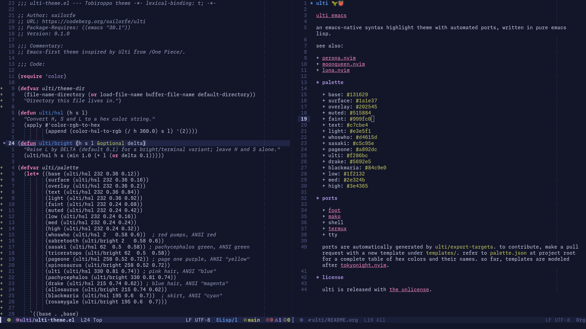

* ulti 🦖👹

an emacs-native syntax highlight theme with automated ports written in pure emacs lisp, inspired by the tobiroppo from /one piece/. currently supports [[https://orgmode.org][org-mode]], [[https://github.com/jrblevin/markdown-mode][markdown-mode]], [[https://magit.vc/][magit]], [[https://github.com/minad/corfu][corfu]], and [[https://github.com/akermu/emacs-libvterm][vterm]]. 

see also:

+ [[https://codeberg.org/sailorfe/perona.nvim][perona.nvim]]
+ [[https://codeberg.org/sailorfe/moonqueen.nvim][moonqueen.nvim]]
+ [[https://codeberg.org/sailorfe/luna.nvim][luna.nvim]]

** palette

+ base: ~#131629~
+ surface: ~#1a1e37~
+ overlay: ~#202545~
+ muted: ~#515884~
+ faint: ~#999fc0~
+ text: ~#c7cbe4~
+ light: ~#e3e5f1~
+ whoswho: ~#d4615d~
+ sasaki: ~#c5c95e~
+ pageone: ~#a892dc~
+ ulti: ~#f286bc~
+ drake: ~#5692e5~
+ blackmaria: ~#84c9e0~
+ low: ~#1f2132~
+ med: ~#2e324b~
+ high: ~#3e4365~

** installation with ~straight.el~

~straight.el~ allows package management from source, not m/elpa tarballs, and easy local development from your ~straight/buld~ directory.

#+BEGIN_SRC lisp
(use-package ulti
  :straight (ulti
             :type git
             :repo "https://codeberg.org/sailorfe/ulti")
  :config
  (add-to-list 'custom-theme-load-path (straight--build-dir "ulti")))
#+END_SRC

** extras

+ [[https://codeberg.org/dnkl/foot][foot]]
+ [[https://github.com/emersion/mako][mako]]
+ shell
+ [[https://termux.dev][termux]]
+ tty
+ [[https://vim-classic.org/][vim classic]] and [[https://vim.org][vim 8+]]

external ports are automatically generated from templates using ~{{ variable }}~ placeholders for keys that can be found in [[file:palette.json][palette.json]]. to contribute:

1. add a file to ~templates/~.
2. edit ~ulti/export-targets~ at the bottom of [[file:ulti-theme.el][ulti-theme.el]] to include a list like ~("templates/INPUT-FILE" . "extras/$APP/OUTPUT-FILE").~
3. run [[file:scripts/build][./scripts/build]] and [[file:scripts/test][./scripts/test]]. test your build directly in the target application and repeat as needed.
4. make a pull request committing your *template file*, *ulti-theme.el* and *your new extra* with a commit message like ~feat(extra): add $APP~.

*** wishlist
- [ ] neovim

** license

ulti is released with [[https://unlicense.org][the unlicense]].
